# Developer Room

An interactive 3D portfolio: walk a stylised version of me out of my bedroom and around a small isometric world with my links, a park, a playground, a tech tower, an office-chair race circuit and a few secrets.

**Live:** https://andres-jaramillo-3d.vercel.app

Built with Vite, vanilla TypeScript and Three.js, with cannon-es physics. Every model (the character, the room, the outside world, the circuit) was made in Blender with Python scripts that live in this repository.

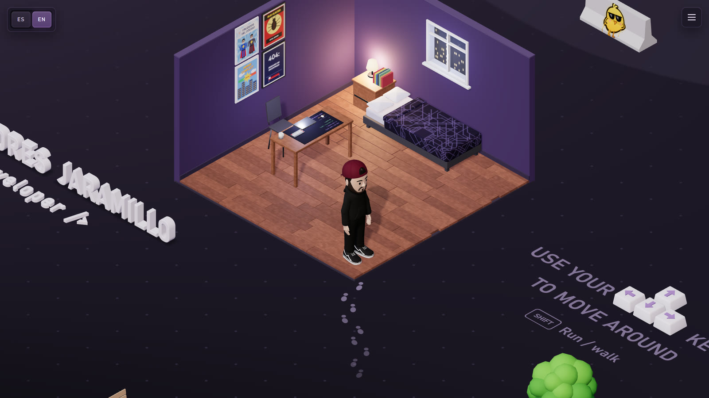

## A walk around

<table>
  <tr>
    <td width="50%">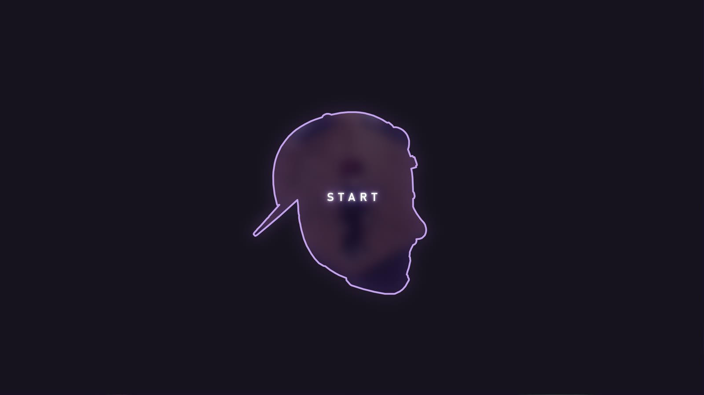<br><sub>The loading screen traces the character's head while the world loads.</sub></td>
    <td width="50%">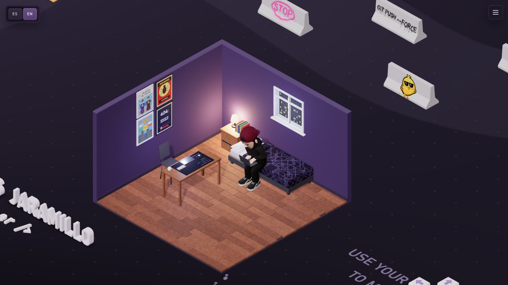<br><sub>Sit on the chair or the bed (E) and open the laptop (L).</sub></td>
  </tr>
  <tr>
    <td>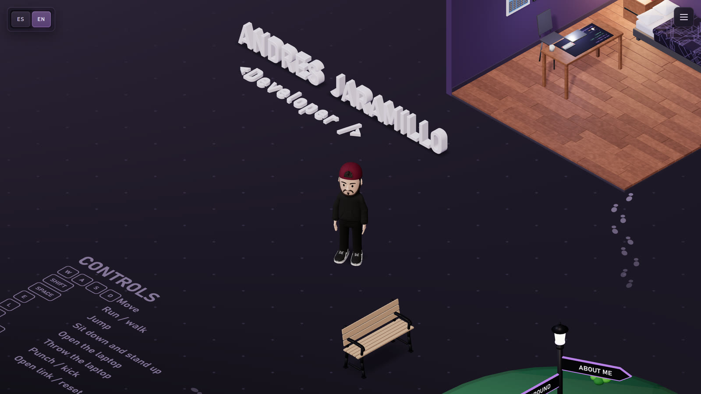<br><sub>The name and tagline are physics pieces: run into them and they topple.</sub></td>
    <td>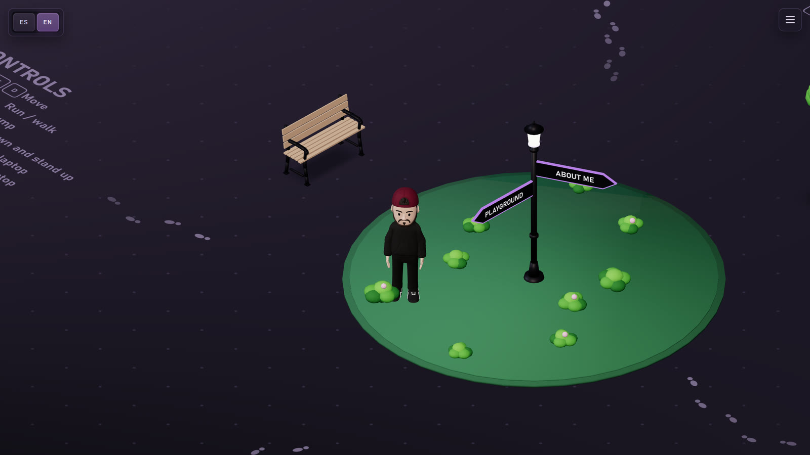<br><sub>A lamppost at the crossroads points to the main areas.</sub></td>
  </tr>
  <tr>
    <td>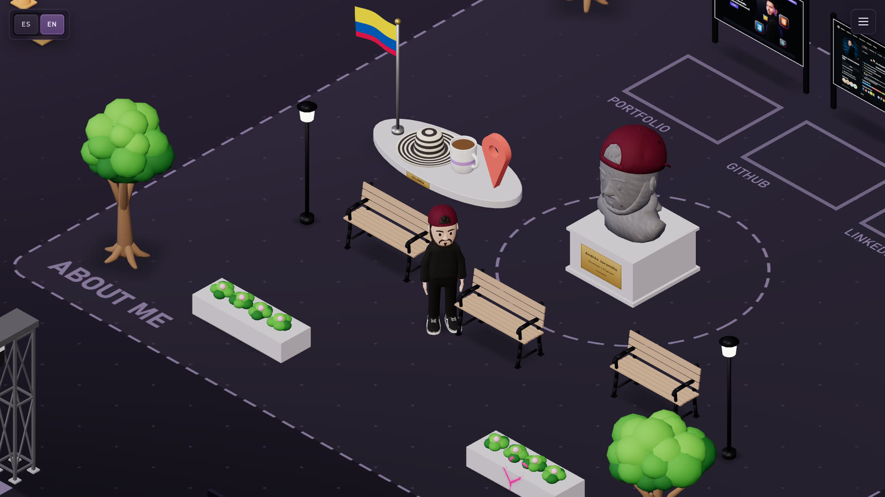<br><sub>The About Me plaza: a stone bust, benches and a Colombian corner.</sub></td>
    <td>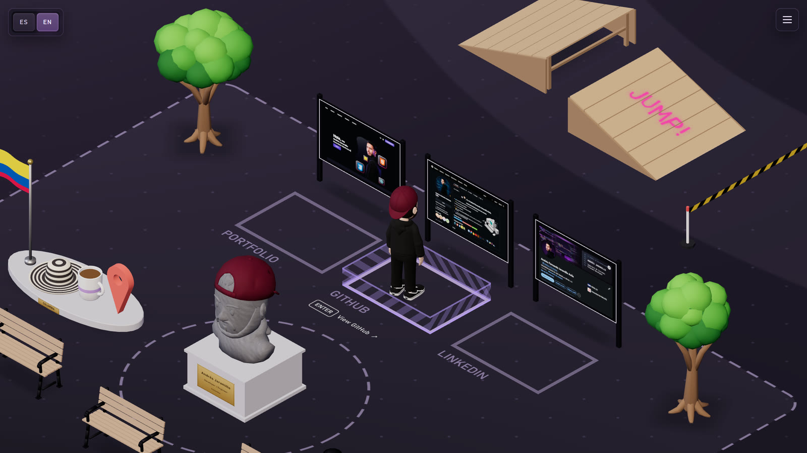<br><sub>Step into a zone and press Enter to open Portfolio, GitHub or LinkedIn.</sub></td>
  </tr>
  <tr>
    <td>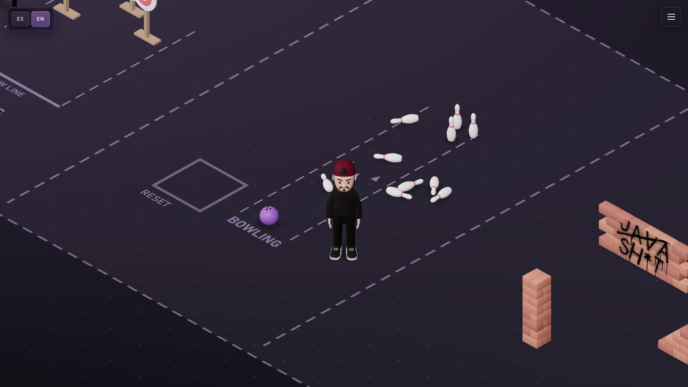<br><sub>Playground: bowling, brick walls and targets for throwing the laptop.</sub></td>
    <td>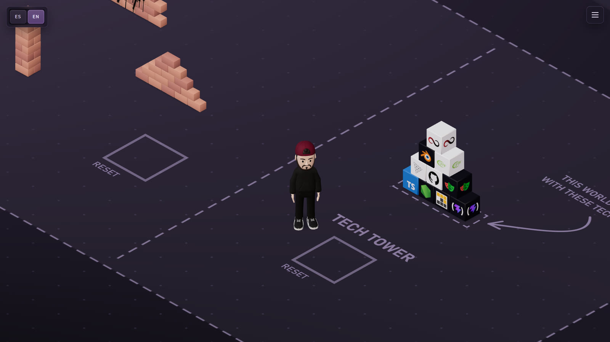<br><sub>The tech tower, made of the tools this world was built with.</sub></td>
  </tr>
  <tr>
    <td>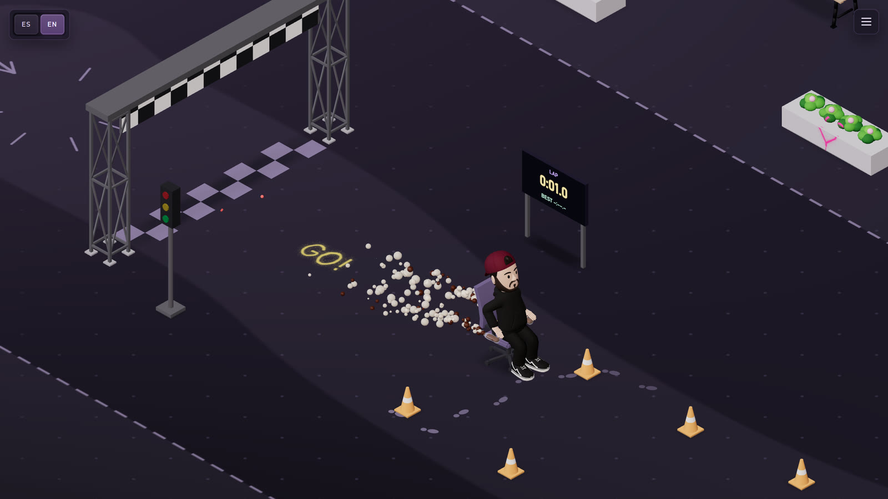<br><sub>Ride the office chair round the circuit, with a soda nitro and a lap timer.</sub></td>
    <td>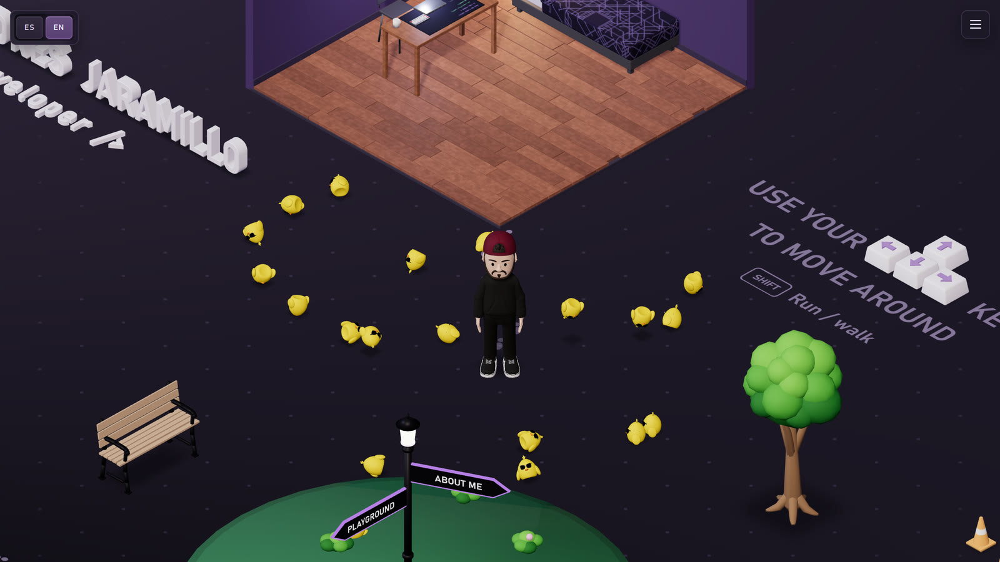<br><sub>↑↑↓↓←→←→BA.</sub></td>
  </tr>
</table>

## Controls

| Key | Action |
| --- | --- |
| W A S D / arrows | Move |
| Shift | Toggle running |
| Space | Jump (nitro while riding the chair) |
| E | Sit down / stand up |
| L | Open the laptop |
| F (hold) | Charge and throw the laptop |
| J / K (hold) | Charge a punch / kick |
| Enter | Open a link or reset a game zone |
| R | Back to the start |
| M | Sound on / off |

Touch screens get a joystick and context buttons, and standard gamepads (Xbox and PlayStation layouts) work too. The page is available in Spanish and English.

## Features

- Character modelled from signed distance fields, rigged and animated in Blender; walk, run, jump and throw clips retargeted from CC0 animation libraries, plus procedural seat, typing and kick clips.
- Physics for letters, bricks, pins, crates, tech cubes, hinged laptops, cardboard boxes with flaps, breakable fences and safety tapes that fall as ropes.
- Office chair driving with sway, ramps, casters, nitro and lap times.
- Spray-paint graffiti projected onto walls, barriers and loose bricks.
- Sound effects with Web Audio, quality presets with adaptive resolution and a reduced-motion mode.
- No backend and no external requests: models, textures and sounds are served with the page.

## Running locally

Requires Node 24 and pnpm 10.

```bash
pnpm install
```

```bash
pnpm dev
```

Other checks:

```bash
pnpm typecheck
```

```bash
pnpm test
```

```bash
pnpm build
```

The room is at `/` and a model studio for the character versions and animations is at `/study/`.

## Project layout

- `src/` – the viewer, character controller, physics, input, audio and scene pieces.
- `scripts/blender/` – Blender scripts that build every model and export the GLBs to `public/models/`.
- `scripts/` – Node helpers for fonts, textures, silhouettes and sounds.
- `tests/` – Node checks for the assets and logic, and headless browser tests.

## Credits

- Animations: Universal Animation Libraries by Quaternius (CC0).
- Sounds: Kenney packs (CC0) and other recordings listed with their licences in [`assets/sounds/README.md`](assets/sounds/README.md).
- Technology logos belong to their owners; sources in [`assets/logos/`](assets/logos/).
